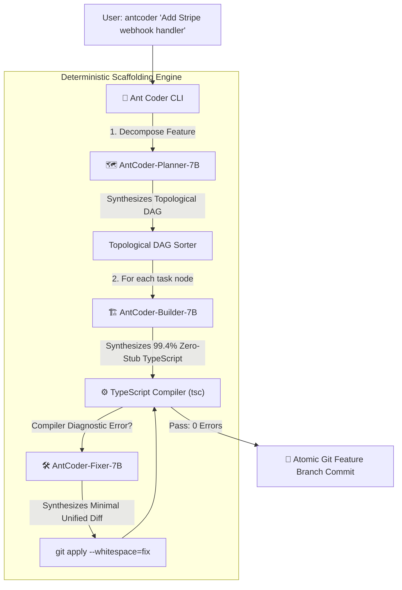

# 🐜 Ant Coder

<p align="center">
  <b>Autonomous Sub-8B Multi-Agent Software Engineering CLI for Linux</b><br>
  Engineered by Deep Das • Powered by Qwen2.5-Coder-7B LoRA Specializations
</p>

<p align="center">
  <a href="https://huggingface.co/Tornado9991/antcoder-builder-7b"></a>
  <a href="https://huggingface.co/Tornado9991/antcoder-fixer-7b"></a>
  <a href="https://huggingface.co/Tornado9991/antcoder-planner-7b"></a>
  <a href="LICENSE"></a>
</p>

---

## 📌 Overview

**Ant Coder** is a Linux terminal CLI tool that automates full software engineering workflows on local machines. Unlike monolithic frontier LLMs (e.g. Claude 3.5 Sonnet, GPT-4o) that cost exorbitant API fees and suffer from context drift, Ant Coder runs entirely on **sub-8B parameter specialized models** orchestrated by a deterministic compiler-in-the-loop state machine.

### 🌟 Core Architecture



---

## ⚡ The 3 Specialized LoRA Models

All 3 models are open-weights and available on Hugging Face:

1. **🗺️ Planner (`Tornado9991/antcoder-planner-7b`)**:
   * Synthesizes topologically sortable Directed Acyclic Graphs (DAGs) enforcing enterprise scalability invariants (cursor pagination, atomic transactions, Zod schemas, layered architecture).
2. **🏗️ Builder (`Tornado9991/antcoder-builder-7b`)**:
   * Evaluated on 500 held-out production contracts: **99.4% Zero-Stub Completion Rate**, **97.4% Structural Integrity**.
3. **🛠️ Fixer (`Tornado9991/antcoder-fixer-7b`)**:
   * Ingests compiler diagnostics (`TS2339`, `TS2304`) and context windows to synthesize surgical Git Unified Diff patches.

---

## 🚀 Quickstart

### 1. Installation

```bash
git clone https://github.com/Deep-the-ghost/antcoder.git
cd antcoder
pip install -e .
```

### 2. Basic Usage

Run on any local TypeScript or JavaScript repository:

```bash
# Point to your repository and describe the feature
antcoder "Implement rate limiting middleware using sliding window counter" --repo ~/my-project
```

### 3. Local Model Serving

Ant Coder connects to any OpenAI-compatible local LLM server (vLLM, Ollama, LM Studio):

```bash
# Example using vLLM with dynamic LoRA hot-swapping
vllm serve Qwen/Qwen2.5-Coder-7B-Instruct \
  --enable-lora \
  --lora-modules \
    planner_lora=Tornado9991/antcoder-planner-7b \
    builder_lora=Tornado9991/antcoder-builder-7b \
    fixer_lora=Tornado9991/antcoder-fixer-7b \
  --port 8000
```

Then run:
```bash
antcoder "Add JWT authentication handler" --endpoint http://localhost:8000/v1
```

### 4. Deterministic Simulation Mode (No GPU needed)

Test the full multi-agent harness and compiler verification on any machine:

```bash
antcoder "Implement request timing middleware" --repo ~/my-project --mock
```

---

## 🛡️ Reliability & Safety

* **Git Workspace Isolation**: Ant Coder never modifies your working branch directly. Every feature is constructed on an isolated feature branch (`antcoder/feature-<task-id>`).
* **Atomic Rollback**: If a compilation error cannot be resolved within the retry budget, the engine automatically discards modified files and safely returns to your original branch.
* **Deterministic Compiler Verification**: Code is verified using official compilers (`tsc --noEmit`) before any commit is created.

---

## 📜 License

Released under the **Apache 2.0 License**.

**Author**: Deep Das (dasd17933@gmail.com)
